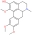
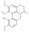
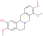
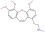
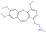

### Results

#### Conception of the Taxonomically Informed Scoring System

The constituents of specialized metabolomes, as expression products of the genome, should reflect the taxonomic position of the producing organisms.
The initial hypothesis of this work is that *the attribution of a score reflecting the taxonomic distance between the biological source of the queried analyte and the one of the candidate structures, is a valuable input for a metabolite annotation process*.

*Taxonomically informed scoring* is proposed to complement the initial score (S~1~ in Figure @fig:taxo-1) attributed to candidate structures by existing metabolite annotation tool.
To this end, the initial score is first normalized.
Then, scores, inversely proportional to the taxa level difference (family < genus < species) are attributed when an exact match is observed between biological source denominations at the different taxa levels.
The score corresponding to the shortest taxonomic distance is then added to the initial score.
Candidates are further re-ranked according to the newly complemented score.
In this study, no phylogenetic distances within taxa (e.g. family, genus or species) were considered due to high computational requirements, but the development of such an approach would be of interest.
The general outline of the *taxonomically informed scoring* system is presented in Figure @fig:taxo-2.

![General outline of the *taxonomically informed scoring* system. Candidates’ structures are complemented with their biological sources at the family, genus and species level, when available. A score, inversely proportional to the taxonomic distance between the biological source of the standard compound and the one of the candidate compounds is given when the biological source of the candidate structures matches the biological source of the standard at the family, genus and species level, respectively. The maximum score for each candidate is then added to its spectral score to yield a complemented spectral score. Finally, candidates are re-ranked according to the complemented spectral score.](images/taxo-2.pdf "taxo-2"){#fig:taxo-2 width="75%"}

In order to apply the *taxonomically informed scoring* in a generic manner, the initial scores given by the metabolite annotation tools were rescaled to obtain values ranging from 0 (worst candidate) to 1 (best candidate).
The scores, given according to the taxonomic distance between the biological source of the queried spectra and the one of the candidate compounds, were integrated in the final score by a sum.
This choice allows to keep independence between individual components of the metascore (see Figure @fig:taxo-1).
Since the boundaries of the candidates’ normalized score in a given dataset are defined (0 to 1), the minimal score to be applied to the worst candidate for it to be ranked at the first position after *taxonomically informed scoring* is 1.
Following our initial hypothesis, a score of 1 was thus given if a match between biological sources was found at the family taxa level.
In the case where the initial maximal score (1) would be given to a candidate and added to a score corresponding to a match at the family level (1), a score of at least 2 should be given for a candidate having the worst score to be ranked above.
A score of 2 was thus given if a match between biological sources was found at the genus taxa level.
Following the same logic, a score of 3 was given for matches between biological sources at the species level.

#### Benchmarking the Influence of Taxonomically Informed Scoring in Metabolite Annotation

##### Establishment of a Benchmarking Dataset

In order to establish the importance of considering taxonomic information in metabolite annotation, an experimental reference dataset constituted by molecular structures, their MS/MS spectra acquired under various experimental conditions and their biological sources, in the form of a fully resolved taxonomic hierarchy, was needed.
This dataset, denominated hereafter *benchmarking dataset*, was built by combining a curated structural/biological sources dataset (obtained from the Dictionary of Natural Products ([DNP](#dnp))) and a curated structural/spectral dataset (obtained from GNPS librairies).
Steps followed for the establishment of the benchmarking dataset are detailed below and summarized in [Supplementary Figure S3](#s3.-overview-of-the-benchmarking-dataset-establishment).

####### Structural and Biological Sources Dataset

The prerequisite to apply a *taxonomically informed scoring* in a metabolite annotation process is to dispose of the biological source information of 1) the queried MS/MS spectra and 2) the candidate structures.
To the best of our knowledge, there is currently no freely available database ([DB](#db)) compiling NP structures and their biological sources down to the species level.
This study uses the [DNP](#dnp)) which is commercially available and allows export of structures and biological sources as associated metadata.
A curation process using the Global Names index, kept biological sources resolved against the Catalogue of Life and resulted in 219,800 entries with accepted scientific names and a full, homogeneous, taxonomy up to the kingdom level.
For example, the entry initially corresponding to pulsaquinone, “Constit. of the roots of *Pulsatilla koreana*”, is converted to Plantae | Tracheophyta | Magnoliopsida | Ranunculales | Ranunculaceae | *Pulsatilla* | *Pulsatilla cernua* in the curated [DB](#db).
See Material and Methods and [Supplementary Figure S3](#s3.-overview-of-the-benchmarking-dataset-establishment) for details concerning the curation process.

####### Structural and Spectral Dataset

The GNPS libraries agglomerate a wide and publicly available ensemble of MS/MS spectra coming from various analytical platforms and thus having different levels of quality [@doi:10.1038/nbt.3597].
These spectral libraries were used as representative source of diverse experimental MS/MS spectra to evaluate the annotation improvement that could be obtained by applying *taxonomically informed scoring*.
All GNPS libraries and publicly accessible third-party libraries were retrieved online ([https://gnps.ucsd.edu/ProteoSAFe/libraries.jsp](https://gnps.ucsd.edu/ProteoSAFe/libraries.jsp)) and concatenated as a single spectral file containing 66,646 individual entries.
The pretreatment described in Material and Methods, yielded a dataset of 40,138 structures (8,558 unique structures) with their experimental associated MS/MS acquired on different platforms.
See [Supplementary Figure S3](#s3.-overview-of-the-benchmarking-dataset-establishment).

####### Structural, Spectral and Biological Sources Dataset (Benchmarking Dataset)

To apply the *taxonomically informed scoring*, it is required that denominations of both 1) the queried spectra and 2) the candidate structures biological sources are resolved using a common taxonomy backbone (i.e. using the accepted denomination).
It was thus necessary to build an experimental spectral dataset for which each entry had a unique structure and a properly documented biological source, which constituted the benchmarking set.
The structural and spectral dataset was matched against the structural and biological sources dataset, following the procedure detailed in Material and Methods.
The full processing resulted in a dataset of 2,107 individual entries (characterized NPs with no stereoisomers distinction and a unique biological source associated), which was used for the rest of this study.
See [Supplementary Figure S3](#s3.-overview-of-the-benchmarking-dataset-establishment).

Analysis of the benchmarking dataset showed a chemodiversity comparable to the one of [DNP](#dnp)) (see panels A and C in Figure @fig:taxo-3).
Regarding the distribution of the biological sources in the benchmarking dataset, available data mostly matched plant specialized metabolites (see panel B in Figure @fig:taxo-3).
Additionally, repartition of mass analyzer types indicated the heterogeneous spectral quality of MS/MS spectra of the benchmarking dataset and was representative of commonly used analytical platforms.
See repartition in [Supplementary Figure S7](#s7.-mosaic-plot-of-the-instrument-sources-vs.-library-origin-vs-number-of-entries-in-the-benchmarking-set).

{#fig:taxo-3 width="80%"}

#### Evaluation of the Improvement of Metabolite Annotation on the Benchmarking Set

In order to assess the importance of considering taxonomic information in the annotation process, the outputs of three different computational MS-based metabolite annotation solutions were considered (ISDB-DNP, MS-Finder and Sirius).
The 2,107 spectra of the benchmarking dataset were queried using these tools.
The precision and accuracy of structural determination with and without the use of *taxonomically informed scoring* were systematically compared according to parameters detailed in the Materials and Methods section.

##### Metabolite Annotation Tools Used 

####### Isdb-Dnp

The first tool, denominated hereafter ISDB-DNP (*In Silico* DataBase—Dictionary of Natural Products) is a metabolite annotation strategy that we previously developed [@doi:10.1021/acs.analchem.5b04804].
This approach is focused on specialized metabolites annotation and is constituted by a pre-fragmented theoretical spectral [DB](#db) version of the [DNP](#dnp)).
The in silico fragmentation was performed by CFM-ID [@doi:10.1007/s11306-014-0676-4].
CFM-ID is, to our knowledge, the only computational solution currently available able to generate a theoretical spectrum with prediction of fragment intensity.
The matching phase between experimental spectra and the theoretical [DB](#db) is based on a spectral similarity measure (cosine score) performed using Tremolo [@doi:10.1021/pr400230p].
The scores are reported from 0 (worst candidate) to 1 (best candidate).

####### Ms-Finder

The second tool is MS-Finder.
This *in silico* fragmentation approach considers multiple parameters such as bond dissociation energies, mass accuracies, fragment linkages and various hydrogen rearrangement rules at the candidate ranking phase (Tsugawa et al., 2016).
The resulting scoring system range from 1 (worst candidate) to 10 (best candidate).

#######  Sirius

The third tool to be used is Sirius 4.0.
It is considered as a state-of-the-art metabolite annotation solution, which combines molecular formula calculation and the prediction of a molecular fingerprint of a query from its fragmentation tree and spectrum [@doi:10.1038/s41592-019-0344-8].
Sirius uses a [DB](#db) of 73,444,774 unique structures for its annotations.
The resulting score is a probabilistic measure ranging between negative infinity (worst candidate) and 0 (best candidate).

##### Computation of the Taxonomically Informed Score

R scripts were written to perform 1) cleaning and standardization of the outputs, 2) *taxonomically informed scoring* and re-ranking.
First, the outputs were standardized to a table containing on each row: the unique spectral identifier (CCCMSLIB N°) of the queried spectra, the short InChIKey of the candidate structures, the score of the candidates (within the scoring system of the used metabolite annotation tool), the biological source of the standard compound and the biological source of the candidate structures.
As described above, a score, inversely proportional to the taxonomic distance between the biological source of the annotated compound and the biological source of the candidate structure, was given when both matched at the family (score of 1), genus (score of 2) or species level(s) (score of 3).
A sum of this score (1 to 3) and the original score (0 to 1) yielded the *taxonomically informed score*.
This *taxonomically informed score* was then used to re-rank the candidates from highest to lowest score.

##### Results Before Taxonomically Informed Scoring

Using each tools’ initial scoring system, on the 2,107 experimental MS/MS spectra constituting the benchmarking set, the ISDB-DNP returned 214 (10.2%) correct annotations at rank 1, Sirius 975 (46.3%) and MS-Finder 180 (8.5%).
The total number of unique correct annotations ranked first covered by ISDB-DNP, Sirius and MS-Finder prior to *taxonomically informed scoring* reached 1110 or 52.7% of the benchmarked dataset.
Out of these, 29 (less than 1.4%), were common to all three tools, indicating the interest of considering various annotation tools when proceeding to metabolite annotation.
Venn diagram in Figure @fig:taxo-4 illustrates the complementarity of returned annotations.
Within all candidates (all ranks), the ISDB-DNP returned 1,750 correct annotations, Sirius 1,589 and MS-Finder 574.
The ROC curves outline the number of correct hits outside first rank and indicate remaining improvement potential.
See [Supplementary Figure S4](#s4.-roc-curves-number-of-correct-annotations-vs.-rank.-full-view-and-zoom).

{#fig:taxo-4 width="100%"}

##### Results After Taxonomically Informed Scoring {.page_break_before}

After *taxonomically informed scoring* and reranking, the number of correct annotations at rank 1 increased to 1,510, 1,508 and 546, respectively for ISDB-DNP, Sirius and MS-Finder. The total number of correct annotations covered by all ISDB-DNP, Sirius and MS-Finder after *taxonomically informed scoring* reached 1786 or 84.8% of the benchmarked dataset. Interestingly, more than 10-fold increase after *taxonomically informed scoring* was also observed for the correctly annotated metabolite commonly returned by the three tools 376 (17%). It has to be noted that no stereoisomer distinction could be performed since all correct matches were assessed based on short InChIKey comparison.

F1 score (harmonic mean of precision and recall rate) was used in order to evaluate the impact of the *taxonomically informed scoring*. More details on the establishment of the score can be found in Material and Methods. The F1 scores of the three metabolite annotation tools before and after taxonomically informed scoring are displayed on Figure @fig:taxo-4. The *taxonomically informed scoring* stage led to a systematic increase of the F1 score for the benchmarked tools. This increase was 7-fold (ISDB-DNP), 1.5-fold (Sirius) and 3-fold (MS-Finder).

#### Optimization of Scores Combination for the Taxonomically Informed Scoring

In order to verify our initial hypothesis and define the optimal scores combination (at the family, genus and species taxa level) to be applied for *taxonomically informed scoring* we proceeded to an optimization of the *taxonomically informed scoring* function.

To this end, the taxonomic information related to candidate annotations was artificially degraded.
This step allowed to mimic a "real life" case in which candidate annotation’s taxonomic metadata are not necessarily complete or correct down to the species level.
Using the procedure detailed in the corresponding Material and Methods section, a Bayesian optimization algorithm was applied four times on four randomized datasets.
It quickly converged (100 iterations) towards a global maximum (max 1,126 hits, see Figure @fig:taxo-5).
The optimal scores were found to be 0.81, 1.62 and 2.55 for the family, genus and species taxa level, respectively.
Such scores are dependent on the nature and completeness of the employed taxonomic metadata.
However, the results obtained when applying the Bayesian optimization on the annotation sets for which taxonomic metadata was randomly degraded, indicated that optimal results were systematically obtained when the *attributed scores were inversely proportional to the taxa hierarchical position*, thus confirming our initial hypothesis.

![Results of the Bayesian optimization converge toward the optimal scores combination required for a maximal number of correct annotations ranked at the first position. This is observed for four randomly degraded training sets (first optimization round displayed). sp, gen and fam axes correspond to the score given when a match is found at the species, genus or family taxa level, respectively. Results confirm that the applied scores should be inversely proportional to the taxonomic distance between the biological source associated with the queried spectra and the biological source of the candidate structures.](images/taxo-5.pdf "taxo-5"){#fig:taxo-5 width="100%"}

#### Application of the Taxonomically Informed Scoring to the Annotation of Metabolites From Glaucium Sp

The interest of the *taxonomically informed scoring* was further illustrated for the annotation of specialized metabolites from *Glaucium* species (Papaveraceae family).
Three species, *G. grandiflorum*, *G. fimbrilligerum* and *G. corniculatum* were studied.
The ethyl acetate and methanolic extracts of the three species were profiled by UHPLC-HRMS in positive ionization mode using a data-dependent MS/MS acquisition.
After appropriate data treatment and molecular network generation (see corresponding Material and Methods section), the *taxonomically informed scoring* was used to re-rank the candidate annotation returned by the ISDB-DNP.
Best five hits were kept.
We especially focused on the two major compounds (MS signal intensity) of *G. grandiflorum*.
These were feature *m/z* 342.1670 at 1.42 min and *m/z* 356.1860 at 1.83 min.
According to the optimization results (see previous section), a score of 0.81 was given to candidates for which the biological source was found to be Papaveraceae at the family level, 1.62 to *Glaucium* at the genus level and 2.55 to *G. grandiflorum* at the species level.
The results of the *taxonomically informed scoring* annotation for feature *m/z* 342.1670 at 1.42 min are presented in Table @tbl:taxo.
See [Supplementary Figure S5](#s5.-output-of-the-taxonomically-informed-scoring-annotation-using-isdb-dnp-for-feature-mz-356.1860-at-1.83-min) for annotation results concerning feature *m/z* 356.1860 at 1.83 min.

\tiny

Table: Output of the *taxonomically informed scoring* annotation using ISDB-DNP for feature *m/z* 342.1670 at 1.42 min.
Predicentrine, the correct annotation, which was initially ranked at the 9th position, is ranked at the first position after *taxonomically informed scoring*. {#tbl:taxo}

|Cluster ID|      Structure        |Short IK |Molecule name |Family |Genus |Species |Family Score |Genus Score |Species Score |Max Taxo Score |Spectral Score |Normalized Spectral Score |Combined Spectral + Taxo Score |Rank Initial |Rank Final |
|-----:|:--------:|:----:|:------:|:------:|:------:|:------:|----:|----:|-----:|----:|-----:|------:|------:|----:|----:|
|1772|      {width=80 height=32}       |OUTYMWDDJORZOH|Predicentrine|Papaveraceae|*Glaucium*|*Glaucium oxylobum*|0.81|1.62|0.00|1.62|0.36|0.23|1.85|9|1|
|1772|      {width=80 height=32}       |QELDJEKNFOQJOY|Isocorydine|Papaveraceae|*Glaucium*|-|0.81|1.62|0.00|1.62|0.34|0.22|1.84|11|2|
|1772|      {width=80 height=32}       |KDFKJOFJHSVROC|Isocorypalmine|Papaveraceae|*Glaucium*|*Glaucium fimbrilligerum*|0.81|1.62|0.00|1.62|0.30|0.14|1.76|28|3|
|1772|      {width=80 height=32}       |JADHMUPTWPBTMT|Secosarcocapnidine Me ether, N-De-Me|Papaveraceae|*Sarcocapnos*|*Sarcocapnos crassifolia*|0.81|0.00|0.00|0.81|0.40|0.32|1.13|1|4|
|1772|      {width=80 height=32}       |WNBUTZHPPULVTP|Secocularidine Me ether, N-de-Me|Papaveraceae|*Ceratocapnos*|*Ceratocapnos claviculata*|0.81|0.00|0.00|0.81|0.39|0.29|1.10|2|5|

\normalsize

Both features were targeted within the extract and, after isolation, the structure of their corresponding compound was determined by 1D and 2D NMR measurements (see spectra in Supplementary Material [S1](#s1.-structural-elucidation-of-predicentrine) and [S2](#s2.-structural-elucidation-of-glaucine)).
NMR spectra of feature *m/z* 342.1670 at 1.42 min matched to the literature reported spectra for predicentrine [@doi:10.1021/np50004a001].
NMR Spectra of feature *m/z* 356.1860 at 1.83 min matched to glaucine [@doi:10.1002/hlca.200490005].
In both cases, the candidate structure proposed *via* the *taxonomically informed scoring* annotation at rank 1 was found to be correct.
With the classical spectral matching process, the correct candidates were initially ranked at positions 9 and 7 for predicentrine and glaucine, respectively (see Table @tbl:taxo and [S5](#s5.-output-of-the-taxonomically-informed-scoring-annotation-using-isdb-dnp-for-feature-mz-356.1860-at-1.83-min) in Supplementary Material).

Additional predicentrine analogues were annotated in the corresponding cluster (see examples in [S6](#s6.-cluster-related-to-predicentrine-in-glaucium-extract) in Supplementary Material).