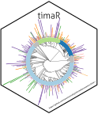

## TIMA {.page_break_before}

This chapter describes improvements that were made to the *Taxonomically Informed Metabolite Annotation* ([TIMA](#tima)) workflow (see Chapter @sec:tima) after publication [@doi:10.3389/fpls.2019.01329].
It addresses the main weaknesses of the published version of the [TIMA](#tima), namely:

- The lack of an accessible chemical compounds occurrences library
- The inability to annotate unconventional adducts
- The complexity of the whole architecture and its automation possibilities

Each one of these points will be discussed and developed solutions illustrated.

### Library

The major limitation of [TIMA](#tima) was the accessibility to structure-organism pairs.
Main resources offering this kind of information were either limited to given organisms, difficult to access in an automatized way or closed at the time.
The *Lotus initiative* described in Chapter @sec:lotus addressed this point.
Each potential user can now easily access LOTUS documented structure-organism pairs through various endpoints and use them in [TIMA](#tima).
Different functions to directly download LOTUS locally, complement it with user-specific pairs, and limit the library to given branches of the tree of life are available.
The number of [2D](#dd) structures able to be re-ranked according to their producing organisms raised to over 140,000.

### Adducts

Another strong limitation was the dependency on the quality and quantity of the initial annotations.
Given the inability of various tools to annotate other ions than [M+H]^+^, this was a strong limiting factor.
While annotation tools evolved to overcome these limitations (the [ISDB](#isdb) can now also annotate [M-H]^-^ ions, for example), solutions to overcome this directly in [TIMA](#tima) were implemented.
The first step was to implement adduct detection based on mass differences of detected features in small retention windows.
Based on a list of common adducts (available at <https://github.com/taxonomicallyinformedannotation/tima-r/blob/main/inst/extdata/source/adducts.tsv>), the expected mass difference between both adducts is calculated.
For example, the [M+NH~4~]^+^ adduct of a molecule corresponds to [M] + 18.03383, while  [M+Na]^+^ to [M] + 22.98977.
The expected mass difference between both adducts is therefore 22.98977 - 18.03383 = 4.95594.
Therefore, if two features with a mass difference of 4.95594 ± 10ppm (or any other tolerance) are found in a 0.1min time window (or any other tolerance), they are annotated as [M+NH~4~]^+^ and [M+Na]^+^.
These adducts are then compared to the library, for which the mass of each adducted form of all [MF](#mf)s was calculated.
The same reasoning is also applied afterward with a list of common neutral losses.
This leads to additional [MS](#ms)^1^-based annotations in complement to the ones generated by classical annotation workflows.
While these annotations are only based on exact mass matches, their intrinsic score is considered 0.
They are only kept if they are supported by the taxonomic weight with a given threshold, or by the newly introduced weight, the chemical consistency.

### Chemical Consistency

As shown in Figure @fig:taxo-1, a structural consistency term was foreseen to complement well the spectral similarity and taxonomic scores.
At the time of publication, this score was not implemented.
It is now in the form of a chemical consistency score.
A chemical class is attributed to the feature, either through a consensus class of its neighbors in the [MN](#mn) or by the canopus module from Sirius [@doi:10.1038/s41587-020-0740-8], according to the origin of the initial annotations.
Default chemical classes attributed are the ones of NPClassifier [@doi:10.1021/acs.jnatprod.1c00399].
In the case of the chemical class inferred by the neighbors, the chemical classes of all neighboring nodes (connected through edges) are taken into account, a consistency score is calculated and if the chemical class is considered consistent, it is attributed to the feature.

When the consensus chemical class is calculated, this process uses the edges of the [MN](#mn), thus requiring spectra to be clustered before re-ranking the annotations.

TODO DETAIL WHY MISCONCEPTIONS

Common misconceptions of the relations between features are therefore illustrated in Figure @fig:ci-7.

.** Two schematic clusters are illustrated, with some classical misinterpretations of the network.](images/ci-7.pdf "ci-7"){#fig:ci-7 short-caption="Common Misconceptions of Feature Relationships in [MN](#mn)" align="center" width="100%"}

Unlike commonly perceived, the main information in [MN](#mn) is in the edges and not the clusters. Clusters can be heavily influenced by the [MN](#mn) size and can be artificially broken because  of the maximum components they can contain.
To compensate for the above-mentioned, setting the maximum component size to 0 is strongly suggested when building an [MN](#mn), in order to maximize the amount of information captured.
Moreover, edges are often artificially limited to 10, to have less congested [MN](#mn)s, but this results in a loss of information.
Setting it to the actually allowed maximum (20, because of computation heaviness) is also strongly suggested.
Finally, complementing the spectral siimilarity edges with [IIN](#iin) edges is also a way to improve the chemical consistency calculation.

TODO RAPPEL IIN

TODO RAPPEL CAS CANOPUS

With the above-mentioned points taken into account, a chemical consistency score can be computed between the attributed chemical class and the chemical class of the annotation of the feature, on the same basis as the biological taxonomy score.

The inclusion of the LOTUS library, related [MS](#ms)^1^ annotation step, and chemical consistency reranking in the [TIMA](#tima) process is illustrated in Figure @fig:ci-6.

 process.** Initial annotations are optionally complemented with [MS](#ms)^1^-based annotations from LOTUS, then reranked based on the biological taxonomy score and further reranked based on the chemical taxonomy score.](images/ci-6.pdf "ci-6"){#fig:ci-6 short-caption="Illustration of the New [TIMA](#tima) Process" align="center" width="100%"}

The next subchapter will describe the benchmarking of the new version of [TIMA](#tima).

### Benchmarking of the Improved Annotation Performance

Thanks to the improvements detailed above and the growth of publically available data, the initial benchmarking set of 2,107 spectra (see Figure @fig:taxo-4) could be extended to 22,388.
This benchmarking is the same as illustrated in Figure @fig:ci-5.
A comparison of the annotation performance prior to and after [TIMA](#tima) is illustrated in Figure @fig:ci-8.

.** Panel A shows the percentage of correct annotations as a function of the rank. Panel B is a zoom of panel A to better see initial ranks. Panel C illustrates the densities of the scores and ranks obtained before and after [TIMA](#tima), as in Figure @fig:ci-5.](images/ci-8.pdf "ci-8"){#fig:ci-8 short-caption="Comparison of the Annotation Performance Prior to and After [TIMA](#tima)" align="center" width="100%"}

As mentioned previously, the performance using spectral similarity only is far from ideal (`//TODO`{.red}. describe line).
After weighing, correct candidates are better ranked, with a slight difference depending on the library used for structure-organism pairs retrieval (`//TODO`{.red}. describe line).
The total number of correct candidates remains the same.
This is not the case when complementing candidates obtained by spectral matching with candidates from a restricted [MS](#ms)^1^ annotation (`//TODO`{.red}. describe line).
The performance increases drastically, reaching `//TODO`{.red}. of candidates correctly annotated at rank 1 and `//TODO`{.red}. in total.

This further highlights the importance of the library used for annotation and the need for better ways to access and prioritize them.

### Improving Use

`//TODO`{.red}.

#### Reducing Complexity

number of languages, manual steps

`//TODO`{.red}.

#### Packaging and Documentation

`//TODO`{.red}.
\captionsetup[figure]{list=no}
`//TODO`{.red}. {#fig:tima-logo align="right" width="30%"}
\captionsetup[figure]{list=yes}

`//TODO`{.red}.

`//TODO`{.red}.

\newpage