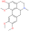

### Taxonomically Informed Scoring Enhances Confidence in Natural Products Annotation {.page_break_before}

#### S1. Structural elucidation of predicentrine

{width="25%" align="left"}

**Predicentrine**: ESI-HRMS (*m/z*): 342.1699 [M + H]+ ; 1H NMR (**600 MHz,Methanol-*d3***) δ: 2.55 (1H, obsc, H-7b), 2.62 (1H,obsc , H-5b), 2.56 (3H, s, N–CH3), 2.70 (1H, dd, *J*=15.6, 4 Hz,H-4b), 3.12 (1H, obsc, H-6a), 3.14(1H, obsc, H-5a), 3.15 (1H, obsc, H-7a), 3.1 (1H, obsc, H-4a), 3.6 (3H, s, O–CH3), 3.88 (3H, s, O–CH3), 3.90 (3H, s, O–CH3), 6.6 (1H, s,H- 3), 6.94 (1H, s,H-8), 8.03(1H, s,H-11),  13C NMR (**600 MHz,Methanol-*d3***), δ: 26.98 (C-4), 32.77(C-7), 41.62 (N-CH3), 52.06 (C-5), 54.22 (C9-OCH3), 54.45 (C10-OCH3), 58.31 (C1-OCH3), 148.78 (C-2), 61.87 (C-6a), 113.4(C-3), 110.56 (C- 8), 110.98 (C-11), 123.67 (C-11a), 124.06 (C-6b), 125.58(C-11b), 127.74 (C-3a), 128.30 (C-7a), 142.50 (C-1), 147.2 (C- 10), 147.50 (C-9). (**\* Not assigned with certainty. "obsc.": The signal is obscured by overlapping peaks**)

**MSMS spectrum of predicentrine was deposited on the GNPS librairies ([CCMSLIB00005436122](https://gnps.ucsd.edu/ProteoSAFe/gnpslibraryspectrum.jsp?SpectrumID=CCMSLIB00005436122)).**

Figure 1 1H NMR spectrum of predicentrine
TODO

Figure 2 COSY spectrum of predicentrine
TODO

Figure 3 DEPT spectrum of predicentrine
TODO

Figure 4 DEPT-HSQC spectrum of predicentrine
TODO

Figure 5 HMBC spectrum of predicentrine
TODO

Figure 6 HRMS spectrum of predicentrine
TODO
