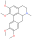
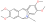

### S5. Output of the taxonomically informed scoring annotation using ISDB-DNP for feature *m/z* 356.1860 at 1.83 min {.page_break_before}

\tiny

Table: S5. Output of the taxonomically informed scoring annotation using ISDB-DNP for feature *m/z* 356.1860 at 1.83 min
Glaucine, which is the correct annotation and was initially ranked at the 7th position, is now ranked at the first position. {#tbl:taxo-supp}

|Cluster ID|       Structure        |Short IK |Molecule name |Family |Genus |Species |Family Score |Genus Score |Species Score |Max Taxo Score |Spectral Score |Normalized Spectral Score |Combined Spectral + Taxo Score |Rank Initial |Rank Final |
|-----:|:--------:|:----:|:------:|:------:|:------:|:------:|----:|----:|-----:|----:|-----:|------:|------:|----:|----:|
|1771|       {width=80 height=32}       |RUZIUYOSRDWYQF|1,2,9,10-Tetrahydroxyaporphine Tetra-Me ether (Glaucine)|Papaveraceae|*Glaucium*|-|0.81|1.62|0.00|1.62|0.43|0.36|1.98|7|1|
|1771|{width=80 height=32}|QGNLUOSBJAGYFF|N-Methylsecoglaucine N-De-Me|Papaveraceae|*Corydalis*|*Corydalis yanhusuo*|0.81|0.00|0.00|0.81|0.49|0.46|1.27|3|2|
|1771|{width=80 height=32}|KUHFDZAEYVTHRS|Thalisopavine Me ether|Papaveraceae|*Papaver*|*Papaver radicatum*|0.81|0.00|0.00|0.81|0.46|0.40|1.21|4|3|
|1771|{width=80 height=32}|QEOWCPFWLCIQSL|Argemonine|Papaveraceae|*Argemone*|*Argemone gracilenta*|0.81|0.00|0.00|0.81|0.44|0.37|1.18|6|4|
|1771|{width=80 height=32}|PSKQBNMDFPYFNM|Platycerine Me ether|Papaveraceae|*Argemone*|*Argemone platyceras*|0.81|0.00|0.00|0.81|0.43|0.35|1.17|8|5|

\normalsize